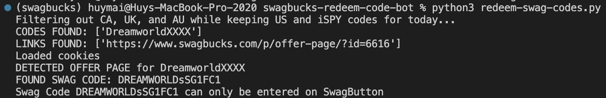

# Swagbucks Swag Code Redeem Bot

A bot that scrapes Swag Codes found on sbcodez.com and redeems them on swagbucks.com. The bot currently does not automatically redeem Mobile App / SwagButton extension only Swag Codes. You can copy these codes printed from terminal and enter them in the Mobile App and/or the SwagButton extension.




## Setup the bot

### Requirements

```
$ pip install -r requirements.txt
```

### config.py

```
$ touch config.py
```
Copy the contents of `config-example.py` into `config.py`.

```
EMAIL = "your email"
PASSWORD = "your password"
```

Replace the `EMAIL` and `PASSWORD` fields with your account email and password.

### Country Filter
The bot defaults to getting and redeeming only US codes.\
If you want to redeem codes from another country, then change the list values in `COUNTRY_FILTER` and the value in `COUNTRY`\
The `country_filter` list and `country` variable are located in the beginning of the `redeem-swag-codes.py` file.\
For example, this code snippet below gets only UK codes.
```
COUNTRY_FILTER = ['CA', 'US', 'AU']
COUNTRY = 'UK'
```


## Run the bot

```
$ python3 redeem-swag-codes.py
```

## License

This project is licensed under the MIT License - see the [LICENSE](LICENSE) file for details